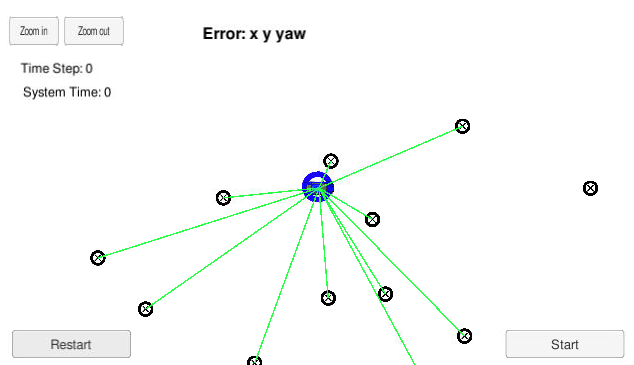
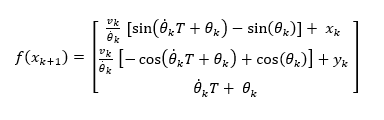
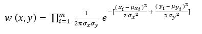
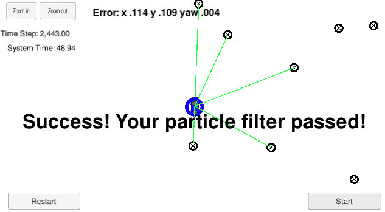
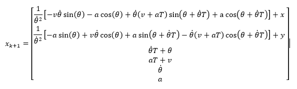

# **Localization (Particle Filter)** 

## Project goal

Implementation of a 2 dimensional particle filter to localize a kidnapped vehicle within an environment of landmarks. The vehicle has a map of its environment, receives sensor (observations) data and control data at each time step.

## Project steps

1. Obtaining map of landmarks and sensor observations: A map of landmarks with coordinates _(x_f, y_f)_ and Landmark ID _id_i_ is stored in `landmark_list.map_landmarks` (member of `class Map`). Sensor observations are stored in a `struct LandmarkObs` vector with attributes of _id, x and y_. Landmarks are illustrated as black circles with crosses inside, while detected landmarks by the sensor (within sensor range) are attached with green lines as shown in Udacity simulator


2. Filter initialization: Position coordinates _(x, y)_ and orientation _theta_ are initialized using a noisy GPS measurement, while particles weight are set to zero.

3. System states prediction: The prediction step is done using `ParticleFilter::prediction()` which contains Constant turn rate and velocity (CTRV) process motion model.


CV model is used in case of straigt-line driving _(theta=0)_.

4. Particles weight update:
  - Observations local coordinates transformation to map global coordinates
  - Landmark detection (within sensor range)
  - Observed-predicted landmarks association
  - Particles weight update _is done using multi-variate gaussian probability distribution formula_
  

  - Particles resampling

5. Filter testing: The simulation test is run for around 50 seconds with a time step of 20 milliseconds (2500 time steps). In case of successful test with low estimation error, a message of **Success! Your particle filter passed!** is shown 



## Reflection

In this project the control input of velocity is small (range of 10 to 40 kph), which will cause a higher error if the same motion model of CTRV is used in case of real life with higher velocities. In such a case, Constant turn rate and acceleration (CTRA) motion model, described by the following transition matrix, will give a better estimation of system states.



### Basic Build Instructions

* Download Udacity Simulator  [here](https://github.com/udacity/self-driving-car-sim/releases).
* This repository includes two files that can be used to set up and install [uWebSocketIO](https://github.com/uWebSockets/uWebSockets) for either Linux or Mac systems. For windows you can use either Docker, VMware, or even [Windows 10 Bash on Ubuntu](https://www.howtogeek.com/249966/how-to-install-and-use-the-linux-bash-shell-on-windows-10/) to install uWebSocketIO. Once the install for uWebSocketIO is complete, the main program can be built and run by doing the following from the project top directory.
1. Clone this repo.
2. Make a build directory: `mkdir build && cd build`
3. Compile: `cmake .. && make` 
   * On windows, you may need to run: `cmake .. -G "Unix Makefiles" && make`
4. Run it: `./particle_filter `

Alternatively some scripts have been included to streamline this process, these can be leveraged by executing the following in the top directory of the project:

1. ./clean.sh
2. ./build.sh
3. ./run.sh

**INPUT**: values provided by the simulator to the c++ program
["sensor_measurement"] => the measurement that the simulator observed (either lidar or radar)

_sense noisy position data from the simulator_

["sense_x"]

["sense_y"]

["sense_theta"]

_get the previous velocity and yaw rate to predict the particle's transitioned state_

["previous_velocity"]

["previous_yawrate"]

_receive noisy observation data from the simulator, in a respective list of x/y values_

["sense_observations_x"]

["sense_observations_y"]


**OUTPUT**: values provided by the c++ program to the simulator

_best particle values used for calculating the error evaluation_

["best_particle_x"]

["best_particle_y"]

["best_particle_theta"]

_Optional message data used for debugging particle's sensing and associations for respective (x,y) sensed positions ID label_

["best_particle_associations"]

_for respective (x,y) sensed positions_

["best_particle_sense_x"] <= list of sensed x positions

["best_particle_sense_y"] <= list of sensed y positions

### Directory structure

```
root
|   build.sh
|   clean.sh
|   CMakeLists.txt
|   README.md
|   run.sh
|
|___data
|   |   
|   |   map_data.txt
|   
|   
|___src
    |   helper_functions.h
    |   main.cpp
    |   map.h
    |   particle_filter.cpp
    |   particle_filter.h
```
